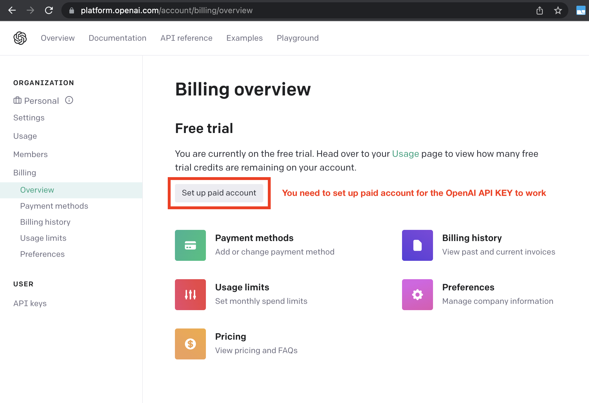

# Welcome to Android Application Moderation Module

For the open source project visit [github.com](https://github.com/MatanelM/AndroidApplicationModeration).

Welcome to the documentation for the Android Application Moderation Module. This comprehensive resource will guide you through integrating our module into your Android app, providing powerful message moderation capabilities. With clear instructions and code examples, you'll be able to ensure a safe and secure user experience. From API key setup to customization options, this documentation covers everything you need to get started.

### 📋 **Requirements**
In order to get started follow this simple [setup](setup.md) guide. After you finish, follow the initialization instructions provided in the documentation.  

You will need to have the following
<ul>
<li>Android studio (gradle 7.3.0 is recommended) </li>
<li>Account on OpenAI for API</li>

</ul>

## 🗝️ **Getting an API key**
Get your OpenAI API key from: [https://platform.openai.com/account/api-keys](https://platform.openai.com/account/api-keys).

<H4 style="margin:0;font-family:arial; font-weight:bold; font-size:16px;padding:6px 12px; background-color:#f0b37e; color:white"> The importance of API keys</H4>

API keys plays a major role in the field of software. API (Application programming interface) is the way to pass JSON objects between servers.
That is essentialy something that your application need to do many times, but you will not be able to see it as it is happenning behind the  scenes. When talking about OpenAI API keys, you will get one free but only with 3 requests per minutes, therefore it is highly recommended to set up a billing plan and have the API key set up from the API panel.
  
After you setup the plan, you can enter the provided link and generate a new key. Note that your key will be visible only when it is generated, therefore it is important you will copy and keep it safe until you add it to your application.

<H4 style="margin:0;font-family:arial; font-weight:bold; font-size:16px;padding:6px 12px; background-color:#1abc9c; color:white"> View usages</H4>

It's highly recommended that you keep track of your API costs on the Usage page. You can also set limits on how much you spend on the Usage limits page.

